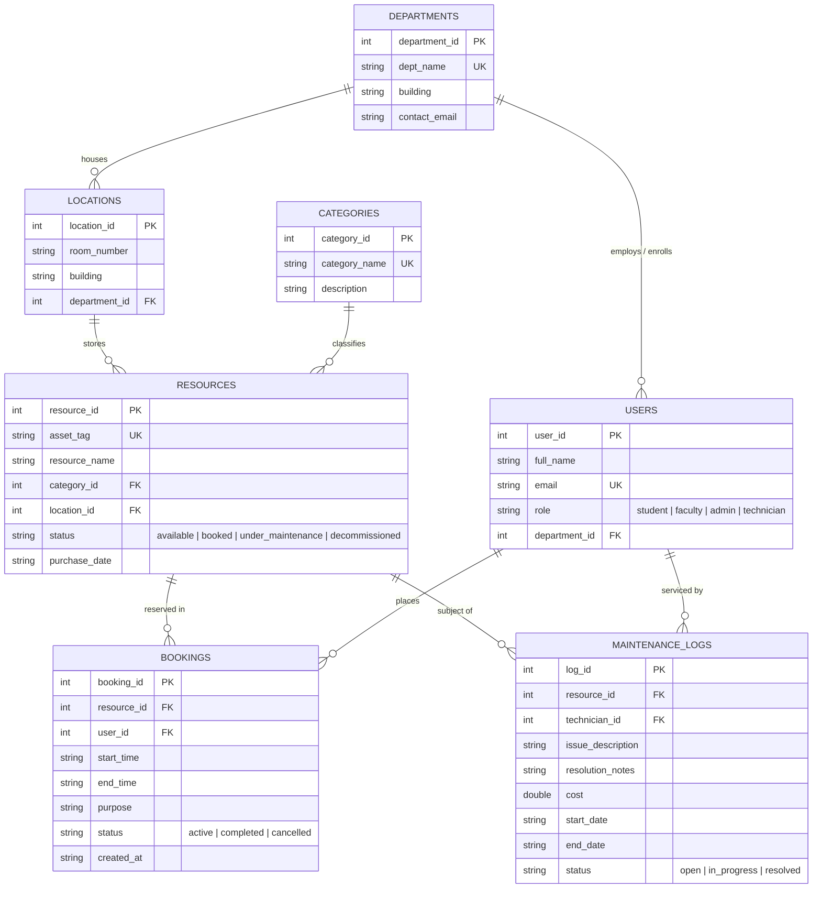

# College Resource Tracker --SQLITE🎓⚡
> **DBMS Mini-Project & Technical Portfolio Project**  
> *Designed a normalized (3NF) relational schema to track college equipment, bookings, and maintenance logs. Implemented CRUD operations through a C++ console interface using secure, parameterized queries.*

---

## 🌟 Overview
**College Resource Tracker** is a relational database management application written in modern C++ (C++17) and SQLite3. It solves the real-world problem of university asset misplacement, booking collisions, and untracked hardware maintenance across multiple engineering departments and laboratories.

### Key Highlights
- **Normalized 3NF Relational Schema**: 7 interconnected tables with foreign key constraints, check constraints, cascading rules, and secondary indexes.
- **Secure Parameterized Queries**: 100% protected against SQL Injection using prepared statements (`sqlite3_prepare_v2`, `sqlite3_bind_*`).
- **ACID-Compliant Transactions**: Atomic booking and maintenance workflows ensuring equipment states never get desynchronized.
- **Modern C++ RAII Architecture**: Zero memory leaks using custom RAII wrappers around SQLite native handles.
- **Interactive Terminal UI**: ANSI colored interface with formatted ASCII tables, live analytics, and an integrated security verification demo.

---

## 🗄️ Database Architecture & ER Diagram



---

## 🚀 Quick Start & Build Instructions

### Prerequisites
- C++ Compiler with C++17 support (`clang++` or `g++`)
- SQLite3 development library (`libsqlite3`)
- `make` utility

### Compilation & Execution
```bash
# 1. Clone or navigate to the project directory
cd college_resource_tracker

# 2. Build the executable using Makefile
make

# 3. Run automated unit & security tests (100% pass verification)
make test

# 4. Launch interactive terminal interface
make run
```

---

## 🛠️ Project Structure

```
college_resource_tracker/
├── Makefile                 # Build automation script
├── README.md                # Project documentation & ER diagram
├── INTERVIEW_GUIDE.md       # Normalization proofs, SQLi defense & interview Q&A
├── db/
│   ├── schema.sql           # 3NF DDL schema with constraints & indexes
│   └── seed_data.sql        # Realistic university dataset (Labs, GPUs, Tools)
├── include/
│   ├── models.hpp           # Domain entities (Resource, Booking, User, etc.)
│   ├── db_manager.hpp       # RAII Database & Statement management
│   ├── resource_service.hpp # Equipment inventory CRUD service
│   ├── booking_service.hpp  # Booking lifecycle & conflict detection
│   ├── maintenance_service.hpp # Service tickets & repair logs
│   └── ui.hpp               # Terminal formatting & ANSI menus
└── src/
    ├── main.cpp             # CLI entrypoint & test suite runner
    ├── db_manager.cpp       # Parameterized query bindings & transaction logic
    ├── resource_service.cpp # Equipment business logic
    ├── booking_service.cpp  # ACID booking scheduling logic
    ├── maintenance_service.cpp # Equipment repair status sync
    └── ui.cpp               # Interactive menus & ASCII table rendering
```

---

## 💻 Key Features & Operations

### 1. Equipment Inventory Management (CRUD)
- **Create**: Add new laboratory equipment with asset tags, categories, locations, and purchase dates.
- **Read**: View all inventory, filter by category/location, or search by status (`available`, `booked`, `under_maintenance`, `decommissioned`).
- **Update**: Modify equipment specs, change locations, or update operational status.
- **Delete**: Safely decommission or remove equipment while enforcing Foreign Key integrity.

### 2. Intelligent Conflict-Free Booking Engine
- Checks time overlaps before confirming reservations:
  $$\text{Overlap} \iff (\text{new\_start} < \text{existing\_end}) \land (\text{new\_end} > \text{existing\_start})$$
- Automatically prevents double-booking and forbids reservations on equipment marked as `under_maintenance`.
- Atomically flips equipment status to `booked` upon booking creation and restores it to `available` upon completion/cancellation.

### 3. Maintenance & Health Tracking
- Technicians can log service tickets, auto-locking the resource into `under_maintenance` status.
- Resolving the ticket records the final repair cost, resolution notes, and timestamp, instantly restoring the resource to `available`.
- Aggregates overall university maintenance expenditure and open ticket metrics.

### 4. Interactive SQL Injection Security Demonstration
- Integrated live demonstration (Menu Option 6) showcasing how malicious payloads such as `' OR '1'='1` are safely treated as literal text values via SQLite prepared statements.

---

## 📚 Interview Preparation Reference
See **[INTERVIEW_GUIDE.md](file:///Users/nayandagur/.gemini/antigravity/scratch/college_resource_tracker/INTERVIEW_GUIDE.md)** for:
1. Mathematical 1NF $\to$ 2NF $\to$ 3NF normalization proofs.
2. Complete functional dependencies ($FD$) analysis.
3. Prepared statements compilation vs execution pipeline diagrams.
4. Top 15 DBMS/C++ interview questions with model answers.
